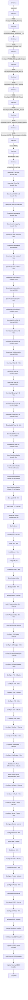

# CMake Workflow

## From WISE-Developers/WISE_Application/main

```mermaid
flowchart TB
WA1[checkout]
--undefined-->
WA2[checkout]
--WISE-Developers/WISE_Versions-->
WA3[checkout]
--WISE-Developers/WISE_Processing_Lib-->
WA4[checkout]
--WISE-Developers/REDapp_Lib-->
WA5[checkout]
--WISE-Developers/WISE_REDapp_Lib_Wrapper-->
WA6[checkout]
--WISE-Developers/WISE_FWI_Module-->
WA7[checkout]
--WISE-Developers/WISE_FBP_Module-->
WA8[checkout]
--WISE-Developers/WISE_Grid_Module-->
WA9[checkout]
--WISE-Developers/WISE_Weather_Module-->
WA10[checkout]
--WISE-Developers/WISE_Scenario_Growth_Module-->
WA11[checkout]
--WISE-Developers/WISE_Communications_Module-->
WA12[checkout]
--microsoft/GSL-->
WA13[checkout]
--eclipse/paho.mqtt.c-->
WA14[checkout]
--eclipse/paho.mqtt.cpp-->
WA15[Download LowLevel include files]
-->
WA16[Download ErrorCalc include files]
-->
WA17[Download Multithread include files]
-->
WA18[Download Math include files]
-->
WA19[Download Geography include files]
-->
WA20[Download Geography include files]
-->
WA21[Download Math protobuf files]
-->
WA22[Download Geography protobuf files]
-->
WA23[Download Math protobuf files]
-->
WA24[Download LowLevel lib  - Win]
-->
WA25[Download LowLevel lib  - Ubuntu 20.04]
-->
WA26[Download LowLevel lib  - Ubuntu 22.04]
-->
WA27[Download ErrorCalc lib  - Win]
-->
WA28[Download ErrorCalc lib  - Ubuntu 20.04]
-->
WA29[Download ErrorCalc lib Ubuntu 22.04]
-->
WA30[Download Multithread lib  - Win]
-->
WA31[Download Multithread lib  - Ubuntu 20.04]
-->
WA32[Download Multithread lib Ubuntu 22.04]
-->
WA33[Download Math lib  - Win]
-->
WA34[Download Math lib  - Ubuntu 20.04]
-->
WA35[Download Math lib  - Ubuntu 22.04]
-->
WA36[Download Geography lib  - Win]
-->
WA37[Download Geography lib  - Ubuntu 20.04]
-->
WA38[Download Geography lib  - Ubuntu 22.04]
-->
WA39[Download WTime lib  - Win]
-->
WA40[Download WTime lib  - Ubuntu 20.04]
-->
WA41[Download WTime lib  - Ubuntu 22.04]
-->
WA42[Unarchive downloaded include files]
-->
WA43[Unarchive downloaded Windows libraries]
-->
WA44[Unarchive downloaded Ubuntu 20.04 libraries]
-->
WA45[Unarchive downloaded Ubuntu 22.04 libraries]
-->
WA46[Set up JDK 8  - Win]
-->
WA47[Set up JDK 11  - Ubuntu]
-->
WA48[Setup the Maven configuration file]
-->
WA49[Cache boost]
-->
WA50[Install boost  - Ubuntu]
-->
WA51[Build zlib  - Win]
-->
WA52[Install boost  - Win]
-->
WA53[Setup Ubuntu]
-->
WA54[Download GDAL  - Win]
-->
WA55[Download protobuf]
-->
WA56[Build protobuf  - Win]
-->
WA57[Build protobuf  - Ubuntu]
-->
WA58[Build Proto definition files  - Ubuntu]
-->
WA59[Build Proto definition files  - Win]
-->
WA60[Load values from versions]
-->
WA61[Configure KMLHelper  - Ubuntu]
-->
WA62[Configure KMLHelper  - Win]
-->
WA63[Configure REDappWrapper  - Ubuntu]
-->
WA64[Configure REDappWrapper  - Win]
-->
WA65[Configure FWI  - Ubuntu]
-->
WA66[Configure FWI  - Win]
-->
WA67[Configure FBP  - Ubuntu]
-->
WA68[Configure FBP  - Win]
-->
WA69[Configure Grid  - Ubuntu]
-->
WA70[Configure Grid  - Win]
-->
WA71[Configure Weather  - Ubuntu]
-->
WA72[Configure Weather  - Win]
-->
WA73[Configure Fire Engine  - Ubuntu]
-->
WA74[Configure Fire Engine  - Win]
-->
WA75[Build Comms Proto definition files  - Ubuntu]
-->
WA76[Build Comms Proto definition files  - Win]
-->
WA77[Configure Defaults  - Ubuntu]
-->
WA78[Configure Defaults  - Win]
-->
WA79[Configure Server Comms  - Ubuntu]
-->
WA80[Configure Server Comms  - Win]
-->
WA81[Configure Status  - Ubuntu]
-->
WA82[Configure Status  - Win]
-->
WA83[Build Java  - Ubuntu]
-->
WA84[Build Java  - Win]
-->
WA85[Configure Paho  - Ubuntu]
-->
WA86[Configure Paho  - Win]
-->
WA87[Configure Project  - Ubuntu]
-->
WA88[Configure Project  - Win]
-->
WA89[Generate versions file]
-->
WA90[Configure WISE  - Ubuntu]
-->
WA91[Configure WISE  - Win]
-->
WA92[Build Windows Installer]
-->
WA93[Upload Windows Installer]
-->
WA94[Build Ubuntu 20.04 Installer]
-->
WA95[Upload Ubuntu 20.04 Installer]
-->
WA96[Build Ubuntu 22.04 Installer]
-->
WA97[Upload Ubuntu 22.04 Installer]
-->
WA99[Complete]
```
