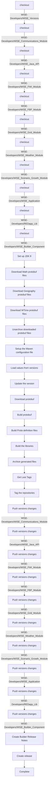

# Maven Package Workflow

## From WISE-Developers/WISE_Builder_Component/main

```mermaid
flowchart TB
BB1[checkout]
--WISE-Developers/WISE_Versions-->
B2[checkout]
--WISE-Developers/WISE_Communications_Module-->
B3[checkout]
--WISE-Developers/WISE_Java_API-->
B4[checkout]
--WISE-Developers/WISE_FWI_Module-->
B5[checkout]
--WISE-Developers/WISE_FBP_Module-->
B6[checkout]
--WISE-Developers/WISE_Grid_Module-->
B7[checkout]
--WISE-Developers/WISE_Weather_Module-->
B8[checkout]
--WISE-Developers/WISE_Scenario_Growth_Module-->
B9[checkout]
--WISE-Developers/WISE_Application-->
B1B0[checkout]
--WISE-Developers/REDapp_Lib-->
B1B1[checkout]
--WISE-Developers/WISE_Builder_Component-->
B1B2[Set up JDK 8]
-->
B1B3[Download Math protobuf files]
-->
B1B4[Download Geography protobuf files]
-->
B1B5[Download WTime protobuf files]
-->
B1B6[Unarchive downloaded protobuf files]
-->
B1B7[Setup the Maven configuration file]
-->
B1B8[Load values from versions]
-->
B1B9[Update the version]
-->
B2B0[Download protobuf]
-->
B2B1[Build protobuf]
-->
B2B2[Build Proto definition files]
-->
B2B3[Build the libraries]
-->
B2B4[Archive generated files]
-->
B2B5[Get Last Tags]
-->
B2B6[Tag the repositories]
-->
B2B7[Push versions changes]
--WISE-Developers/WISE_Communications_Module-->
B2B8[Push versions changes]
--WISE-Developers/WISE_Java_API-->
B2B9[Push versions changes]
--WISE-Developers/WISE_FWI_Module-->
B3B0[Push versions changes]
--WISE-Developers/WISE_FBP_Module-->
B3B1[Push versions changes]
--WISE-Developers/WISE_Grid_Module-->
B3B2[Push versions changes]
--WISE-Developers/WISE_Weather_Module-->
B3B3[Push versions changes]
--WISE-Developers/WISE_Scenario_Growth_Module-->
B3B4[Push versions changes]
--WISE-Developers/WISE_Application-->
B3B5[Push versions changes]
--WISE-Developers/REDapp_Lib-->
B3B6[Push versions changes]
--WISE-Developers/WISE_Builder_Component-->
B3B7[Create Builder Release Notes]
-->
B3B8[Create release]
-->
B4B0[Complete]
```
