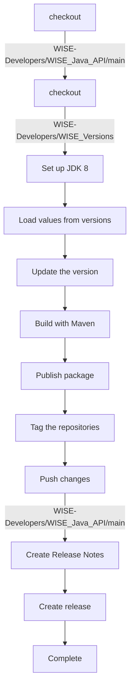

# Maven Package Workflow

## From WISE-Developers/WISE_Java_API/main

```mermaid
flowchart TB
WJV1[checkout]
--WISE-Developers/WISE_Java_API/main-->
WJV2[checkout]
--WISE-Developers/WISE_Versions-->
WJV3[Set up JDK 8]
-->
WJV4[Load values from versions]
-->
WJV5[Update the version]
-->
WJV6[Build with Maven]
-->
WJV7[Publish package]
-->
WJV8[Tag the repositories]
-->
WJV9[Push changes]
--WISE-Developers/WISE_Java_API/main-->
WJV10[Create Release Notes]
-->
WJV11[Create release]
-->
WJV13[Complete]
```
