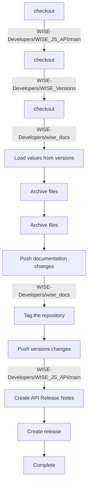

# Archive the source Workflow

## From WISE-Developers/WISE_JS_API/main

```mermaid
flowchart TB
WJS1[checkout]
--WISE-Developers/WISE_JS_API/main-->
WJS2[checkout]
--WISE-Developers/WISE_Versions-->
WJS3[checkout]
--WISE-Developers/wise_docs-->
WJS4[Load values from versions]
-->
WJS5[Archive files]
-->
WJS6[Archive files]
-->
WJS7[Push documentation changes]
--WISE-Developers/wise_docs-->
WJS8[Tag the repository]
-->
WJS9[Push versions changes]
--WISE-Developers/WISE_JS_API/main-->
WJS10[Create API Release Notes]
-->
WJS11[Create release]
-->
WJS13[Complete]
```
