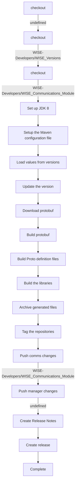

# Maven Package Workflow

## From WISE-Developers/WISE_Manager_Component/main

```mermaid
flowchart TB
M1[checkout]
--undefined-->
M2[checkout]
--WISE-Developers/WISE_Versions-->
M3[checkout]
--WISE-Developers/WISE_Communications_Module-->
M4[Set up JDK 8]
-->
M5[Setup the Maven configuration file]
-->
M6[Load values from versions]
-->
M7[Update the version]
-->
M8[Download protobuf]
-->
M9[Build protobuf]
-->
M10[Build Proto definition files]
-->
M11[Build the libraries]
-->
M12[Archive generated files]
-->
M13[Tag the repositories]
-->
M14[Push comms changes]
--WISE-Developers/WISE_Communications_Module-->
M15[Push manager changes]
--undefined-->
M16[Create Release Notes]
-->
M17[Create release]
-->
M19[Complete]
```
