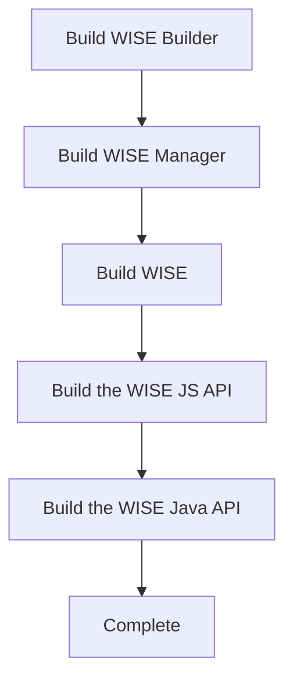

# Trigger Release Workflow

## From WISE-Developers/WISE_Versions/main

```mermaid
flowchart TB
WV1[Build WISE Builder]
-->
WV2[Build WISE Manager]
-->
WV3[Build WISE]
-->
WV4[Build the WISE JS API]
-->
WV5[Build the WISE Java API]
-->
WV7[Complete]
```
