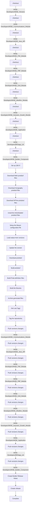

# Maven Package Workflow

```mermaid
flowchart TB
1[checkout]
--WISE-Developers/WISE_Versions-->
2[checkout]
--WISE-Developers/WISE_Communications_Module-->
3[checkout]
--WISE-Developers/WISE_Java_API-->
4[checkout]
--WISE-Developers/WISE_FWI_Module-->
5[checkout]
--WISE-Developers/WISE_FBP_Module-->
6[checkout]
--WISE-Developers/WISE_Grid_Module-->
7[checkout]
--WISE-Developers/WISE_Weather_Module-->
8[checkout]
--WISE-Developers/WISE_Scenario_Growth_Module-->
9[checkout]
--WISE-Developers/WISE_Application-->
10[checkout]
--WISE-Developers/REDapp_Lib-->
11[checkout]
--WISE-Developers/WISE_Builder_Component-->
12[Set up JDK 8]
-->
13[Download Math protobuf files]
-->
14[Download Geography protobuf files]
-->
15[Download WTime protobuf files]
-->
16[Unarchive downloaded protobuf files]
-->
17[Setup the Maven configuration file]
-->
18[Load values from versions]
-->
19[Update the version]
-->
20[Download protobuf]
-->
21[Build protobuf]
-->
22[Build Proto definition files]
-->
23[Build the libraries]
-->
24[Archive generated files]
-->
25[Get Last Tags]
-->
26[Tag the repositories]
-->
27[Push versions changes]
--WISE-Developers/WISE_Communications_Module-->
28[Push versions changes]
--WISE-Developers/WISE_Java_API-->
29[Push versions changes]
--WISE-Developers/WISE_FWI_Module-->
30[Push versions changes]
--WISE-Developers/WISE_FBP_Module-->
31[Push versions changes]
--WISE-Developers/WISE_Grid_Module-->
32[Push versions changes]
--WISE-Developers/WISE_Weather_Module-->
33[Push versions changes]
--WISE-Developers/WISE_Scenario_Growth_Module-->
34[Push versions changes]
--WISE-Developers/WISE_Application-->
35[Push versions changes]
--WISE-Developers/REDapp_Lib-->
36[Push versions changes]
--WISE-Developers/WISE_Builder_Component-->
37[Create Builder Release Notes]
-->
38[Create release]
-->
40[Complete]
```
